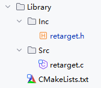

## 重定向printf到USART1

在Clion中链接的是`GNU-Tools-ARM-Embedded\arm-none-eabi\include`里面的`stdio.h`，如果仍然想使用`printf`函数功能，则需要进行如下操作

添加`retarget.h`、`retarget.c`和`CMakeLists.txt`



在顶层`CMakeLists.txt`中添加如下代码：

```cmake
# Add User Library
add_subdirectory(Library)
# Add linked libraries
target_link_libraries(${CMAKE_PROJECT_NAME}
    stm32cubemx

    # Add user defined libraries
        user_library
)
```

添加到工程，更新CMake，编译之后会发现，有几个系统函数重复定义了，被重复定义的函数位于Src目录的`syscalls.c`文件中，我们把里面重复的几个函数删掉即可。

在main函数的初始化代码中添加对头文件的引用并注册重定向的串口号：

```c
...
/* USER CODE BEGIN Includes */
#include "retarget.h"   //重定向printf
/* USER CODE END Includes */
...
...
...
/* USER CODE BEGIN Init */
RetargetInit(&huart1); //重定向printf
/* USER CODE END Init */
...
```

编写代码测试功能：

```c
char buf[100];

printf("\r\nYour name: ");
scanf("%s", buf);
printf("\r\nHello, %s!\r\n", buf);
```

**上面的修改完成之后可能会发现无法正常读取浮点数，这里修改cmake目录下的gcc-arm-none-eabi.cmake，注释下行代码**

```cmake
set(CMAKE_EXE_LINKER_FLAGS "${CMAKE_EXE_LINKER_FLAGS} --specs=nano.specs")
```

