# 配置CLion用于STM32开发

## 1.环境及所需工具

软件环境：

- Windows10
- STM32CubeMX（Version：6.15.0）
- STM32CubeCLT（Version：1.19.0）
- OpenOCD（Version：20250710）
- CLion（2025.1）

硬件环境：

- STM32F103RCT6（FK103M2-V1.1）
  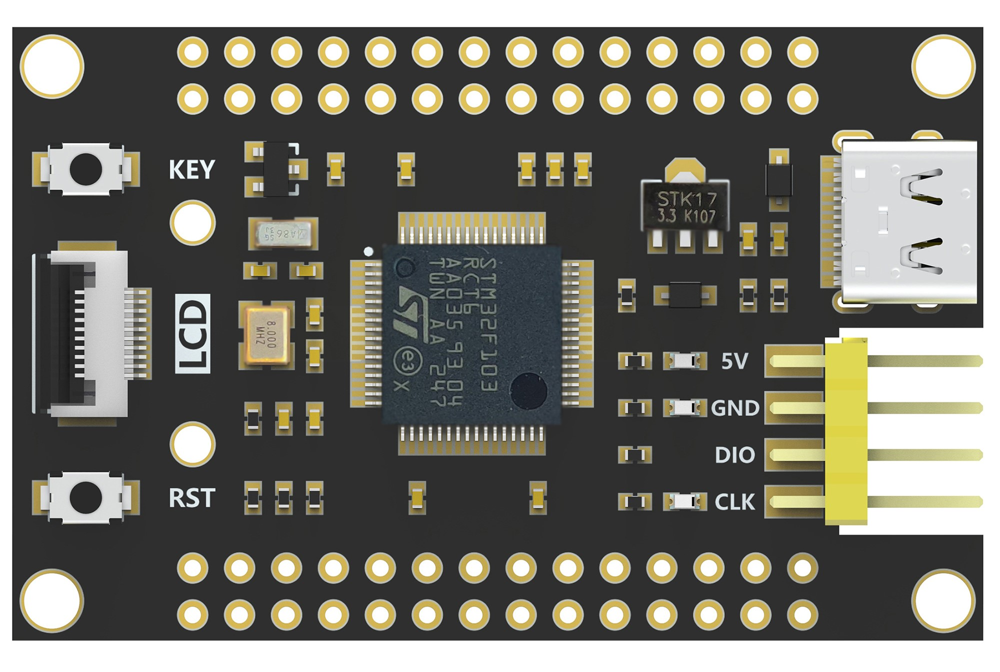
- ST-Link下载器
  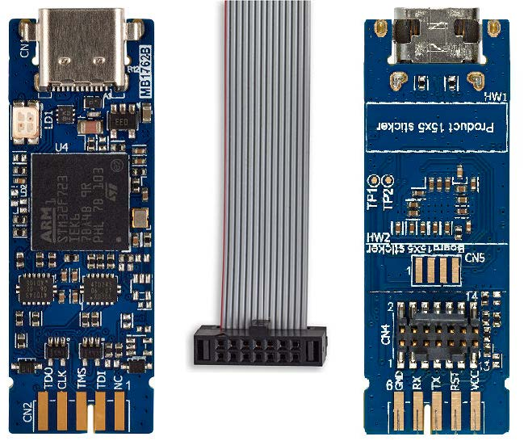

### 工具安装

1. STM32CubeMX：官网下载安装：https://www.st.com.cn/en/development-tools/stm32cubemx.html
2. STM32CubeCLT：官网下载安装：https://www.st.com.cn/en/development-tools/stm32cubeclt.html
3. CLion：官网下载安装：https://www.jetbrains.com/clion/download
4. OpenOCD
    OpenOCD是用于对STM32进行下载仿真的工具，是一个开源软件包，Windows版本下从[这里](https://gnutoolchains.com/arm-eabi/openocd/)下载，下载好解压到一个目录就行，后面会在Clion中链接这个目录
    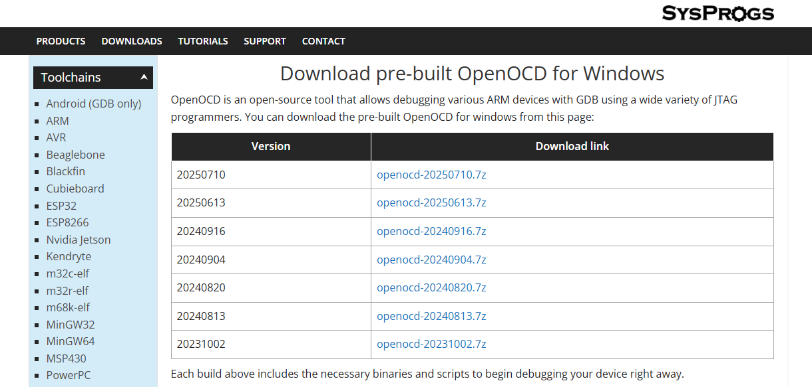

### 环境配置

1. 系统环境变量：将OpenOCD\bin添加到系统环境变量，STM32CubeCLT软件安装后会自动添加到系统环境变量。
    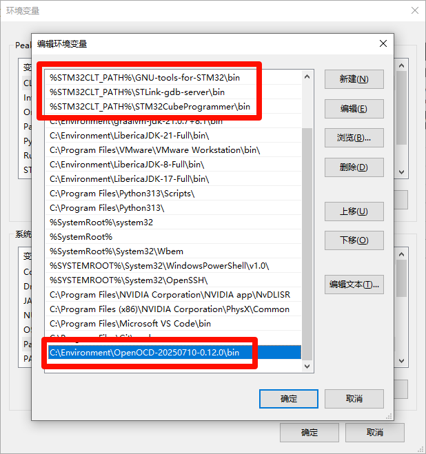
    
2. 在CLion中配置OpenOCD, STM32CubeMX, STM32CubeCLT地址：
    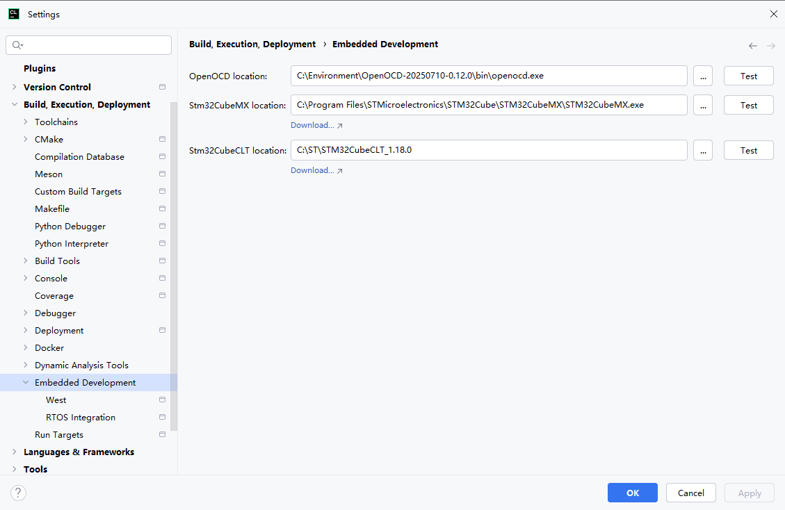

  

## 2.在Clion中创建STM32工程

### 创建CubeMX工程

打开STM32CubeMX创建工程，Toolchain/IDE: CMake, Default Compiler/Linker: GCC，点击生成代码，使用CLion打开工程。

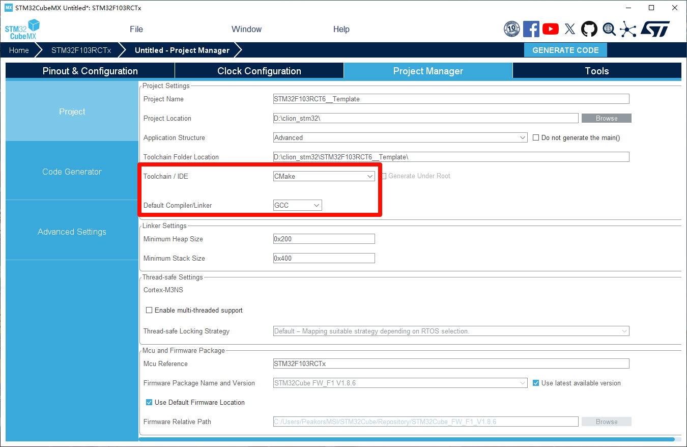

### CLion配置

首次打开项目，会弹出导入CMake工程选项，选择Debug - Debug，勾上Enable profile。

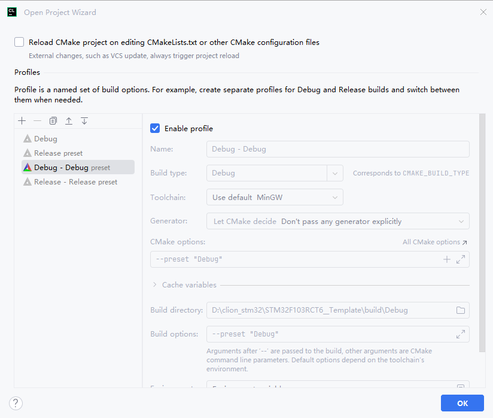

### 烧录程序

我们在工程根目录创建一个配置文件Download.cfg，文件内容如下：

```C
source [find interface/stlink.cfg]
transport select swd
source [find target/stm32f1x.cfg]
adapter speed 10000
```

如果使用Dap-Link：

```c
adapter driver cmsis-dap
transport select swd
source [find target/stm32f1x.cfg]
adapter speed 10000
```

点击顶栏中的STM32F103RCT6__Template选择Edit Configurations

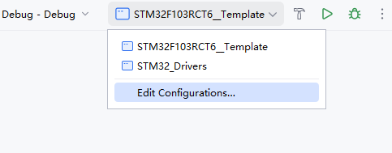

删除原有的CMake Application，点击加号选择OpenOCD Download & Run

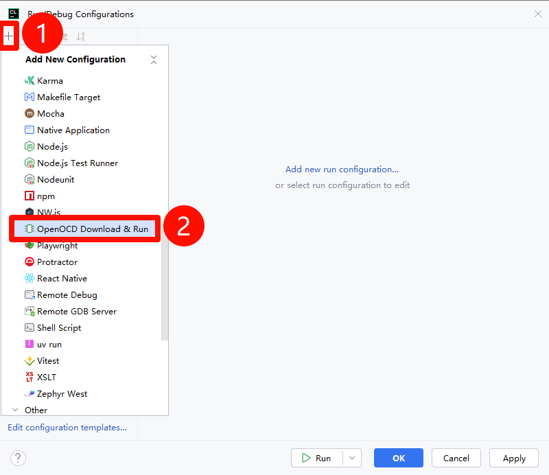

Target选择`STM32F103RCT6__Template`， Executable binary选择`STM32F103RCT6__Template`，Board config file选择我们上面创建的`Download.cfg`

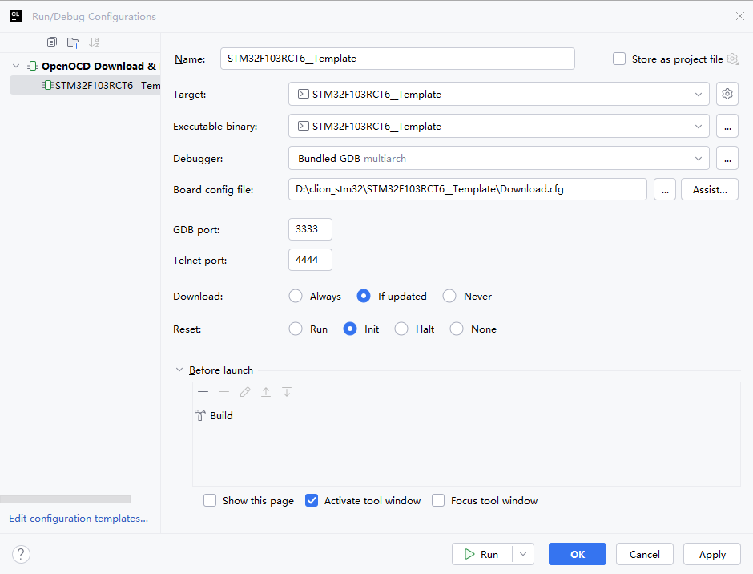

顶栏的这三个图标分别是**编译**、**下载**、**调试**：

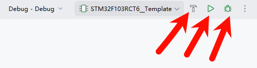

点击编译可用看到编译输出：

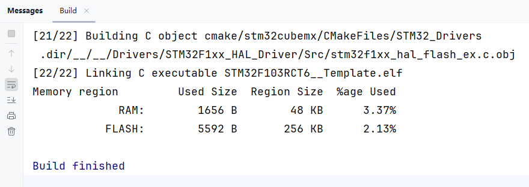

点击下载讲程序下载到板子：

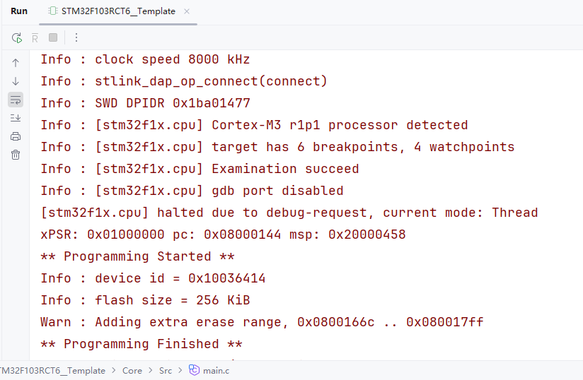


### 在线调试

点击顶栏中的STM32F103RCT6__Template选择Edit Configurations，新建一个配置选择Embedded GDB Server

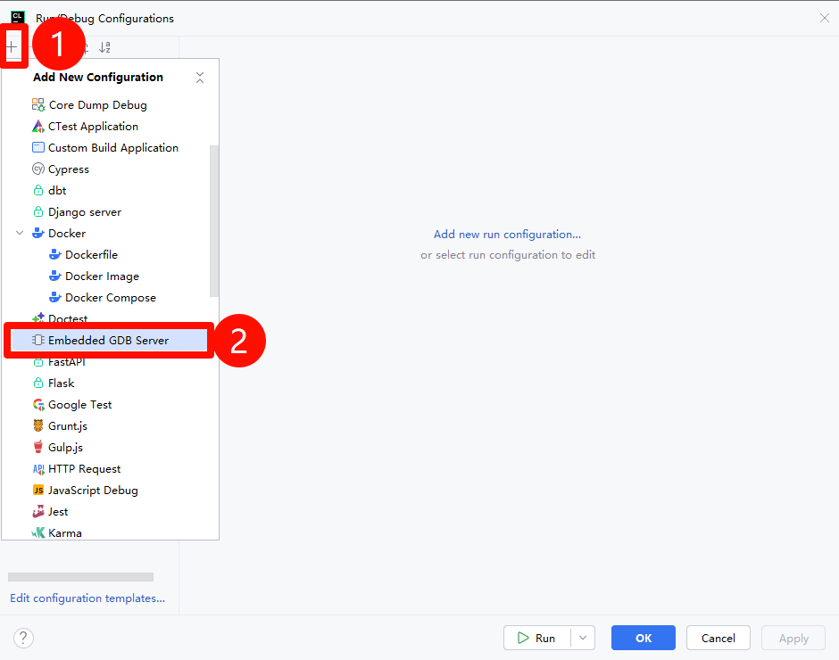


填入下列数据

```
Name: Debug
Executable binary: STM32F103RCT6__Template
'target remote' args: localhost:3333
GDB Server: 此处填入OpenOCD.exe地址
GDB Server args: -f interface/stlink.cfg -f "D:/clion_stm32/STM32F103RCT6__Template/Download.cfg"
```


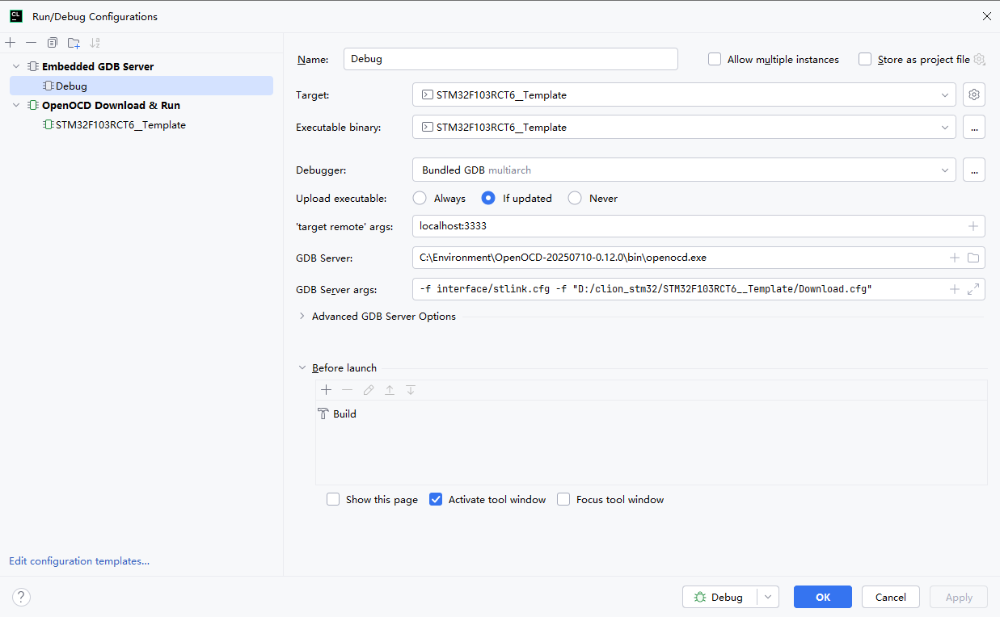


点击调试按钮进入Debug，看到如下信息说明成功进入Debug模式

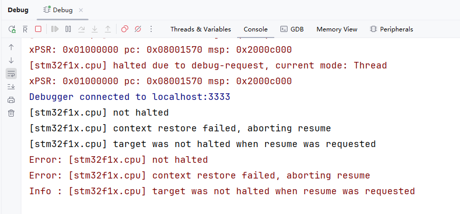


在程序代码上打断点即可让程序暂停

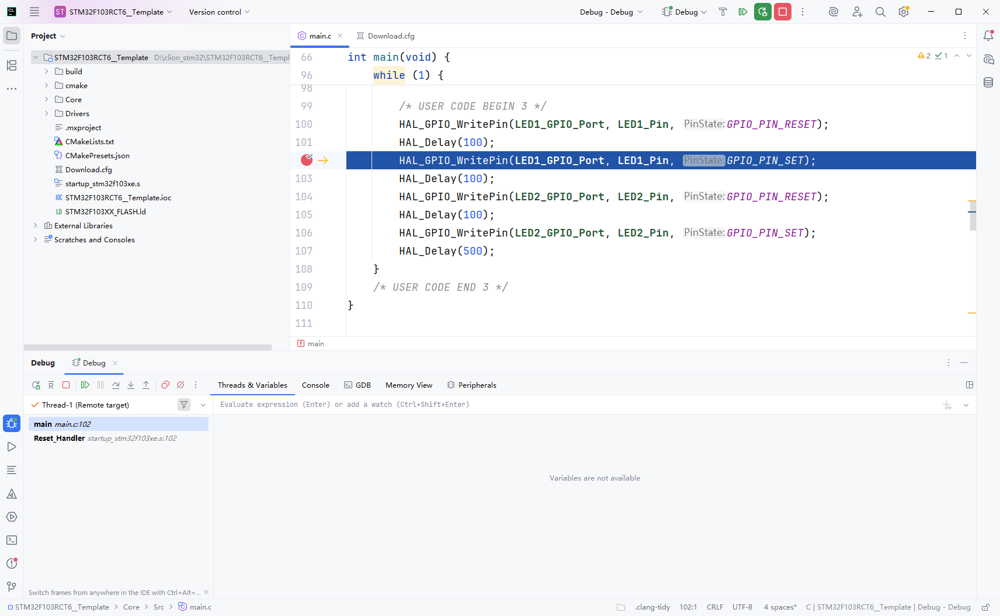


查看外设数据：

点击Peripherals选择Load .svd File加载STM32F103xx.svd

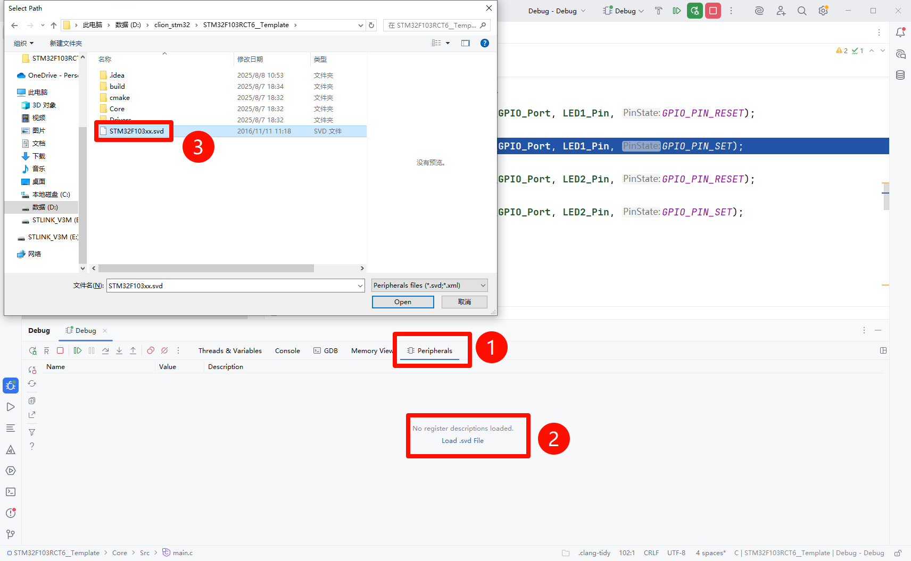


在弹出的窗口中选择要查看的外设数据，这里选择FLASH

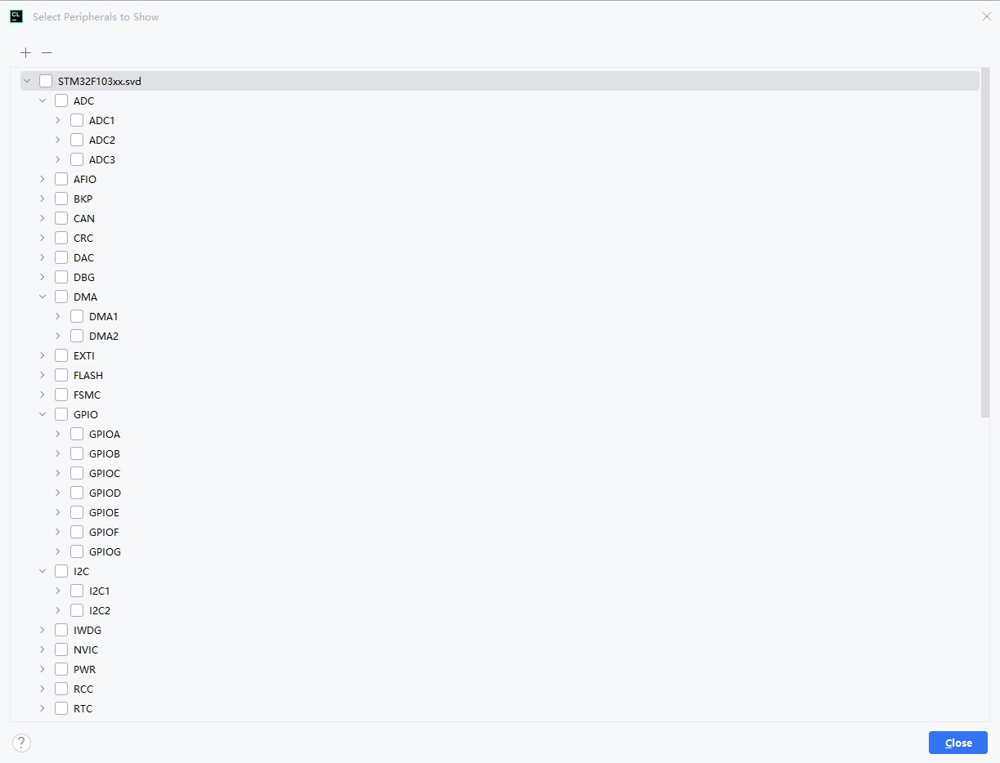


在Peripherals中可以看到寄存器名称、寄存器内容和简介。 

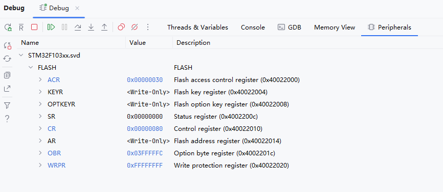


