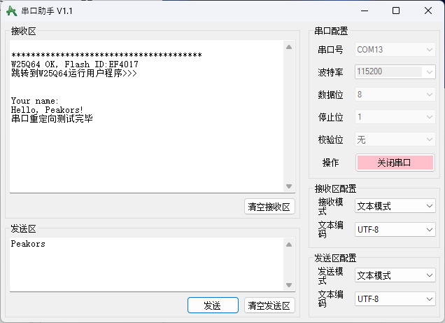

# STM32H750XBH6 Template

基于反客STM32H750XBH6核心板(FK750M5-XBH6-SDRAM)的CLion + CubeMX + CMake + OpenOCD的外部Flash下载算法模板

感谢群友`子衿`、`JasonGu`的帮助，站在了巨人的肩膀上完成了该项目模板

文档参考资料：www.armbbs.cn/forum.php?mod=viewthread&tid=116240

注意：

- 添加printf和scanf重定向到串口1，具体代码参考`retarget.c`和`retarget.h`.
- 
- 添加USB虚拟串口，感谢群友`琴梨project`, 具体实现见：blog.csdn.net/weixin_51002159/article/details/126644375
- 添加项目名称修改Python脚本，详见`RenameProject.py`